# CUDA Best Practices Experiments

统一记录 GPU 环境：

| 项目 | 值 |
| --- | --- |
| GPU 型号 | NVIDIA A100 80GB PCIe |
| CUDA Toolkit 版本 | 12.8 |

## 计时基线

当前实验使用 [`cpu_gpu_timers.cu`](./cpu_gpu_timers.cu)。

运行命令：

```bash
nvcc -O3 -std=c++17 cpu_gpu_timers.cu -o cpu_gpu_timers
./cpu_gpu_timers
```

原理：

- `host_submit_ms` 只量 CPU 把工作提交给 GPU 的时间，通常只覆盖 `event record + kernel launch` 这段 host-side 开销。
- `kernel_ms` 只量 GPU 上 `start event -> kernel -> end event` 之间的设备执行时间。
- `end_to_end_ms` 覆盖调用方从 launch 到 `cudaDeviceSynchronize()` 返回的真实等待时间，所以它把“提交”和“GPU 真正完成”都算进去了。

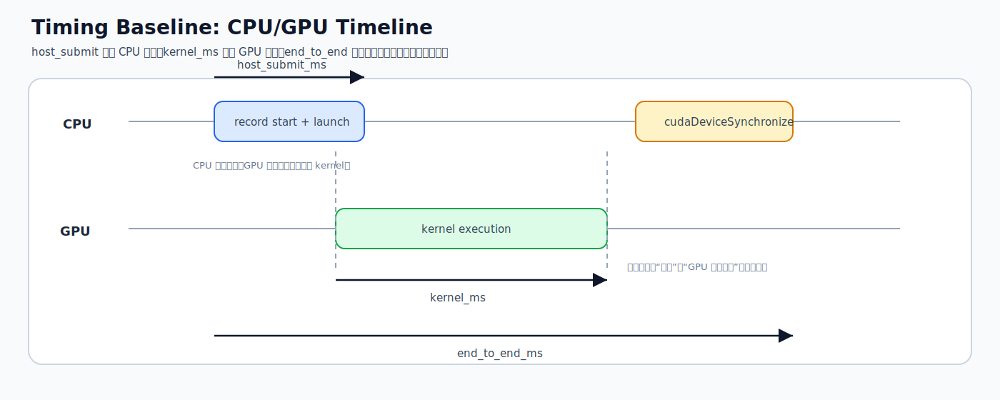

实验记录：

| input | host_submit_ms | kernel_ms | end_to_end_ms |
| --- | --- | --- | --- |
| 100000000 | 0.010 | 0.297 | 0.299 |

一页对比表：

| 指标 | 当前写法 | 测到什么 | 适合比较什么 |
| --- | --- | --- | --- |
| `host_submit_ms` | `std::chrono` 包住 event record + kernel launch | host 提交 GPU 工作的开销 | launch overhead |
| `kernel_ms` | `cudaEventElapsedTime(start, end)` | kernel 在 GPU 上的执行时间 | kernel 优化前后 |
| `end_to_end_ms` | `std::chrono` 包住 launch + `cudaDeviceSynchronize()` | 调用方真正等待完成的总时间 | 端到端收益 |

统一计时模板：

```text
input:
host_submit_ms:
kernel_ms:
end_to_end_ms:
```

这个结果说明 `std::chrono`、`cudaEvent`、端到端时间确实在测三件不同的事；和上面的时间线对应，`host_submit` 很短，不代表 GPU 工作已经完成。

## Pageable vs Pinned

当前实验使用 [`pinned_pageable_cp.cu`](./pinned_pageable_cp.cu)。

运行命令：

```bash
nvcc -O3 -std=c++17 pinned_pageable_cp.cu -o pinned_pageable_cp
./pinned_pageable_cp
```

原理：

- `H2D` / `D2H` 真正高效的路径依赖 DMA；DMA 需要页锁定内存，所以 `pinned host memory` 可以直接和 GPU 设备内存搬运。
- `pageable host memory` 通常不能直接交给 DMA，driver 往往要先把数据拷到一块临时 `pinned staging buffer`，再发起设备传输，所以路径更长。

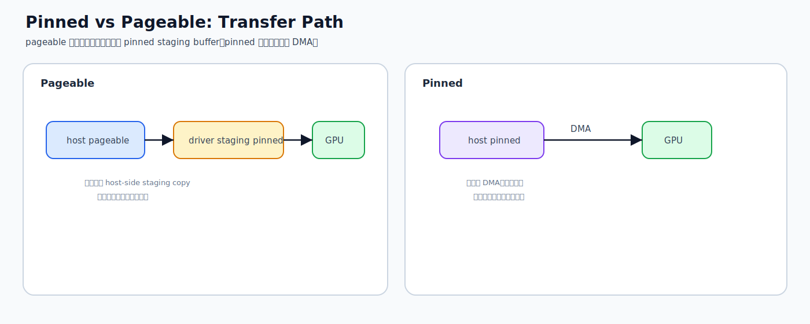

带宽表：

| size_mb | pageable_h2d | pageable_d2h | pinned_h2d | pinned_d2h | pageable_check | pinned_check |
| --- | --- | --- | --- | --- | --- | --- |
| 1 | 1.843 | 10.270 | 22.588 | 22.650 | PASS | PASS |
| 4 | 18.911 | 13.572 | 25.217 | 25.249 | PASS | PASS |
| 16 | 22.223 | 14.951 | 26.404 | 26.090 | PASS | PASS |
| 64 | 18.590 | 15.111 | 26.632 | 26.280 | PASS | PASS |

这个结果说明 pinned memory 对 `H2D` / `D2H` 带宽都有明显提升，尤其小规模 `H2D` 提升非常大；和上面的路径图对应，就是少掉了 pageable 那段额外 staging copy。

## Multi Stream Overlap

当前实验使用 [`multi_stream_overlap.cu`](./multi_stream_overlap.cu)。

运行命令：

```bash
nvcc -O3 -std=c++17 multi_stream_overlap.cu -o multi_stream_overlap
./multi_stream_overlap
```

原理：

- 单个 stream 里，`H2D -> kernel -> D2H` 对同一 chunk 是严格按顺序排队的，所以时间线上基本是串行。
- 把总数据切成多个 chunk 后，不同 chunk 放进不同 stream，就可以让某个 chunk 在 copy、另一个 chunk 在 compute，从而利用 copy engine 和 SM 的并行性。

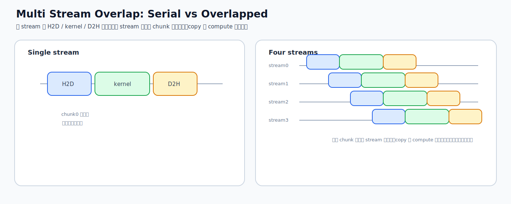

实验记录：

| total_mb | streams | compute_iters | repeats | single_stream_ms_avg | multi_stream_ms_avg | speedup | validation |
| --- | --- | --- | --- | --- | --- | --- | --- |
| 128 | 4 | 96 | 20 | 10.731 | 8.080 | 1.328 | PASS |

这个结果说明把 `pinned H2D -> kernel -> D2H` 按分块放进多个 stream 后，copy 和 compute 可以产生可观察的 overlap，端到端时间比单 stream 更短；和上面的时间线对应，就是把原本串行的三个阶段错峰重叠起来了。

## Offset vs Stride Copy

当前实验使用 [`offset_stride_copy.cu`](./offset_stride_copy.cu)。

运行命令：

```bash
nvcc -O3 -std=c++17 offset_stride_copy.cu -o offset_stride_copy
./offset_stride_copy
```

原理：

- global memory coalescing 看的不是“单个线程自己是不是顺着走”，而是“同一条 warp 指令发出时，32 个 lane 的地址能不能被合并成少量内存请求”。
- `contiguous` 最容易合并；`offset` 往往只是多碰一个 segment；`stride` 会把同一拍 warp 的地址拉得很散，所以有效带宽下降最明显。

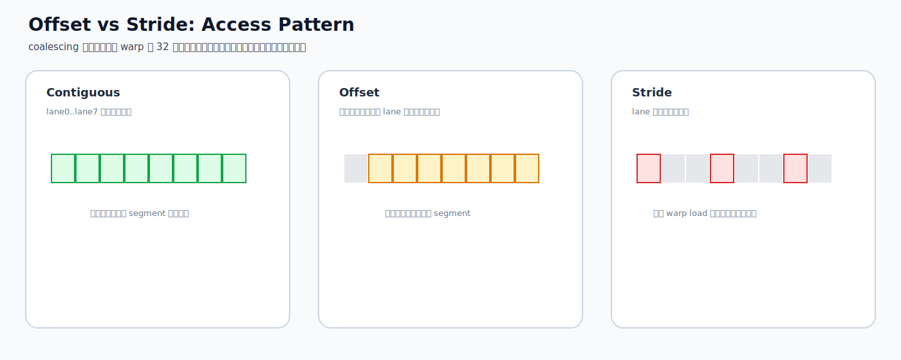

实验记录：

| total_mb | repeats | offset_floats | stride | contiguous_GBps | offset_GBps | stride_GBps | contiguous_check | offset_check | stride_check |
| --- | --- | --- | --- | --- | --- | --- | --- | --- | --- |
| 64 | 20 | 1 | 8 | 793.865 | 657.425 | 163.881 | PASS | PASS | PASS |

这个结果说明连续访问带宽最高，轻微 offset 会带来一定损失，而 stride 访问会明显降低有效带宽；和上面的 lane 地址分布图对应，真正把带宽拉垮的是 warp 级请求被拆得太碎。

## Shared Memory GEMM

当前实验使用 [`gemm.cu`](./gemm.cu)。

运行命令：

```bash
nvcc -O3 -std=c++17 gemm.cu -o gemm
./gemm
```

原理：

- shared memory 的第一层收益是把 block 内会重复使用的数据先搬到片上，这样内层循环不必让每个线程反复发 global load。
- 但 shared memory 不是“放进去就一定快”。如果 tile 的行列布局让同一拍访问集中到少数 bank，上一个瓶颈刚压下去，下一个瓶颈就会变成 bank conflict。
- 所以这组实验真正想拆开看的是两件事：`global load reuse` 和 `shared bank conflict`。

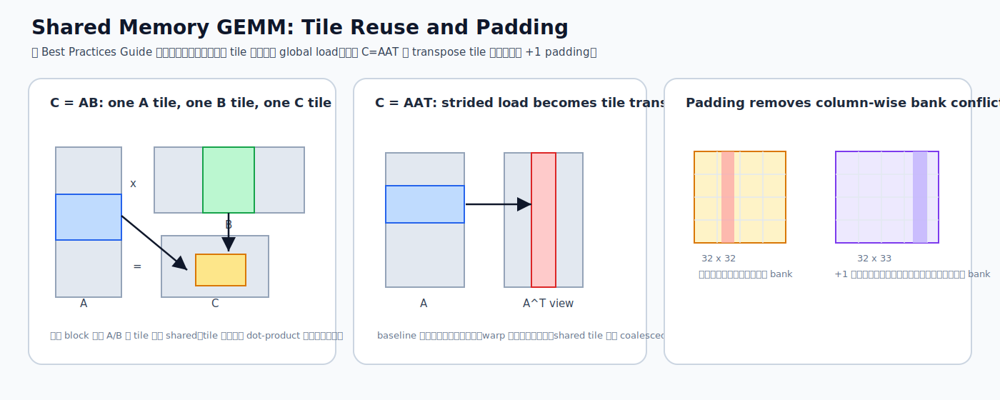

当前程序包含两组实验：

- `C = AB`：`baseline` / `shared_a` / `shared_ab`
- `C = AAT`：`baseline` / `shared` / `shared_padded`

其中 `C = AAT` 更适合拿来观察 shared memory 的真实收益，因为它能把“global load 冗余”与“shared bank conflict”这两件事拆开看。

一次代表性运行结果：

| experiment | variant | ms | speedup vs baseline | check |
| --- | --- | --- | --- | --- |
| `C=AB` | baseline | 0.601 | 1.000 | PASS |
| `C=AB` | shared_a | 0.561 | 1.072 | PASS |
| `C=AB` | shared_ab | 0.441 | 1.362 | PASS |
| `C=AAT` | baseline | 7.750 | 1.000 | PASS |
| `C=AAT` | shared | 2.502 | 3.097 | PASS |
| `C=AAT` | shared_padded | 0.665 | 11.654 | PASS |

### 为什么 `AAT baseline` 慢

`AAT baseline` 对应：

```cpp
sum += a[row * cols + k] * a[col * cols + k];
```

这里单线程沿 `k` 的访问确实连续，但 GPU 发起 global load 是以 warp 为单位合并的，所以更关键的是“同一拍里 warp 的 32 个线程访问是否容易合并”。

对第二个 load `a[col * cols + k]` 来说：

- 同一 warp 内 `col` 连续变化
- 当 `cols=1024` 时，相邻线程地址步长是 `1024 * 4B = 4096B`
- 也就是一条 warp load 会打到 32 条不同 cache line

只看这一次指令的 coalescing，理论 line 利用率大约是：

```text
useful bytes / fetched bytes
= (32 * 4B) / (32 * 128B)
= 3.125%
```

但是这还不是全部。因为每个线程随后会继续沿 `k` 连续访问，所以 cache 仍然能把很多 line 吃满。这也是为什么 baseline 的 `L1/L2 hit rate` 并不低，但它仍然慢：问题不是“miss 太多”，而是“重复发了太多 global load 指令”。

### Nsight Compute 细化对比

下面的 NCU 数据来自：

```bash
ncu --target-processes all \
  --kernel-name regex:gemm_aat_baseline_kernel \
  --launch-skip 1 --launch-count 1 \
  --section MemoryWorkloadAnalysis \
  --section LaunchStats \
  ./gemm
```

以及对应的 `gemm_aat_tiled_kernel` / `gemm_aat_tiled_padded_kernel`。

为了避免把 README 变成 profiler 原始转储，这里只保留最关键的计数器和派生结论。

#### 1. Kernel time 与整体结论

| variant | ncu kernel time (ms) | 结论 |
| --- | --- | --- |
| baseline | 10.259 | 慢在 global load 冗余，不是 cache miss |
| shared | 3.310 | global load 明显减少，但 shared bank conflict 很重 |
| shared_padded | 0.885 | 既减少 global load，又基本消掉 shared bank conflict |

#### 2. Global load 指令与 L1/L2 行为

| variant | global ld inst | L1 global load sectors | sectors / request | L1 hit rate | L2 hit rate | DRAM read bytes |
| --- | --- | --- | --- | --- | --- | --- |
| baseline | 67,108,864 | 1,107,296,256 | 16.5 | 99.26% | 97.99% | 4,328,448 |
| shared | 2,097,152 | 37,748,736 | 18.0 | 78.56% | 97.80% | 4,198,656 |
| shared_padded | 2,097,152 | 37,748,736 | 18.0 | 78.42% | 98.05% | 4,199,040 |

关键观察：

- baseline 的 `L1/L2 hit rate` 很高，不支持“它慢是因为 cache miss 多”这个说法。
- baseline 真正的问题是它执行了 `67,108,864` 次 warp 级 global load 指令，而两个 shared-memory 版本只有 `2,097,152` 次，正好少了 `32x`。
- 也就是说，shared-memory 版本把 block 内本该复用的数据先搬到片上缓存，避免每个线程在内层循环里重复向 L1/L2 提请求。

#### 3. Shared memory 冲突

| variant | shared ld inst | shared st inst | shared bank conflicts load | shared bank conflicts store | total conflicts |
| --- | --- | --- | --- | --- | --- |
| baseline | 0 | 0 | 0 | 0 | 0 |
| shared | 16,777,216 | 2,097,152 | 234,885,133 | 32,709,719 | 267,594,852 |
| shared_padded | 41,943,040 | 2,097,152 | 7,816 | 92,334 | 100,150 |

这个表回答了为什么 `shared` 和 `shared_padded` 会差这么多：

- 两者的 global load 指令数相同，DRAM 读流量也几乎一样
- 差别主要不在 global memory，而在 shared memory 布局
- 无 padding 版本把转置 tile 写成 `col_tile[tx][ty]`，后续读取会造成严重 bank conflict
- 加 `+1` padding 后，shared conflict 从 `2.676e8` 级别降到 `1.001e5`，吞吐就明显释放出来了

#### 4. Occupancy 不是这组结果的主因

| variant | registers/thread | static shared memory/block | occupancy limit registers | occupancy limit shared mem | occupancy limit warps |
| --- | --- | --- | --- | --- | --- |
| baseline | 32 | 0 B | 2 | 8 | 2 |
| shared | 32 | 8192 B | 2 | 3 | 2 |
| shared_padded | 29 | 8320 B | 2 | 3 | 2 |

这说明：

- 三个 kernel 都不是因为 occupancy 差异才拉开一个数量级
- `shared` 和 `shared_padded` 的 occupancy 约束几乎一样
- 真正决定性能差距的是：
  1. 有没有消掉 block 内重复的 global load
  2. shared memory 转置后有没有引入 bank conflict

### 数据结论

- `AAT baseline` 慢，不是因为 `L1/L2 hit rate` 低；相反，它的 cache hit 很高。
- `AAT baseline` 慢，是因为它把本应在 block 内复用的数据重复以 global load 的形式请求了 `32x`。
- `AAT shared` 已经把 global load 压下来了，但如果 shared tile 的转置布局不加 padding，会把瓶颈从 global memory 转移到 shared bank conflict。
- `AAT shared_padded` 证明了 Best Practices 里那条结论：shared memory 不是“放进去就快”，布局同样决定性能。

对 LeetGPU 题解的启发：

- 看到 block 内会反复使用同一片输入时，先想“能不能把 global load 数量按 tile 维度压掉”。
- 做 transpose 或列主访问的 shared tile 时，要默认检查 bank conflict，而不是只看 coalescing。
- `cache hit rate 高` 不等于 `kernel 已经没有访存问题`；如果请求数本身就冗余，hit 再高也还是会慢。

## L2 Access Window

当前实验使用 [`L2_window.cu`](./L2_window.cu)。

运行命令：

```bash
nvcc -O3 -std=c++17 L2_window.cu -o L2_window
./L2_window
```

原理：

- `accessPolicyWindow` 的目标不是“把整块大数据都锁进 L2”，而是把真正高频复用的那一段尽量映射到 persisting set-aside L2。
- 如果 `fixed hitRatio=1.0` 且高频窗口已经超过 set-aside 容量，就会在保留区里自己打自己，结果是 cache thrashing。
- 更稳的做法是把想保留在 L2 里的热数据规模固定住，再用 `hitRatio` 控制实际驻留比例。

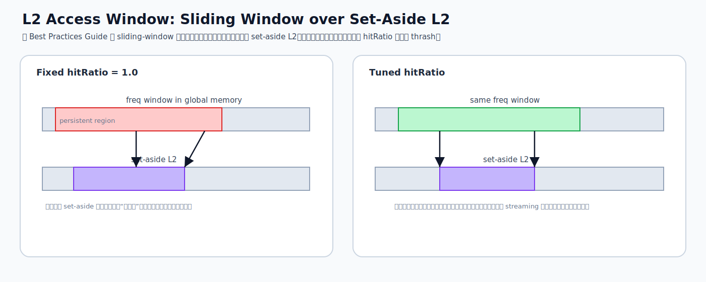

环境记录：

| 项目 | 值 |
| --- | --- |
| GPU | NVIDIA A100 80GB PCIe |
| L2 cache | 40 MB |
| desired set-aside | 30 MB |
| actual persisting set-aside | 25 MB |
| access policy max window | 127.996 MB |

实验记录：

| freq_mb | streaming_mb | baseline_ms | fixed_hitratio_ms | tuned_hitratio_ms | fixed_speedup | tuned_speedup | sink_check |
| --- | --- | --- | --- | --- | --- | --- | --- |
| 10 | 1014 | 3.627 | 2.284 | 2.366 | 1.588 | 1.533 | PASS |
| 20 | 1004 | 3.568 | 2.481 | 2.480 | 1.439 | 1.439 | PASS |
| 30 | 994 | 3.457 | 4.203 | 3.011 | 0.823 | 1.148 | PASS |
| 40 | 984 | 3.314 | 4.045 | 3.238 | 0.819 | 1.024 | PASS |
| 50 | 974 | 3.262 | 3.999 | 3.398 | 0.816 | 0.960 | PASS |
| 60 | 964 | 3.283 | 4.018 | 3.542 | 0.817 | 0.927 | PASS |

这个结果说明 `fixed hitRatio=1.0` 在 persistent 数据能装进 set-aside L2 时收益明显，但超过 set-aside 后会出现 thrashing；把 `num_bytes` 固定为 `20MB` 并按 `20MB / (freqSize * sizeof(int))` 调 `hitRatio` 后，大窗口场景更稳。

提速原因：

- 高频访问的 persistent 数据能更多命中 persisting L2，减少对 HBM 的访问
- 当 `freq_mb` 较小、数据能放进 set-aside L2 时，`fixed hitRatio=1.0` 收益最明显
- 当 `freq_mb` 变大时，`tuned hitRatio` 通过限制实际驻留规模，减少了 cache thrashing

降速原因：

- `fixed hitRatio=1.0` 在 persistent 数据超过 set-aside L2 容量后会强行让过大的工作集争抢 L2
- streaming 数据也在持续访问剩余区域，会进一步冲刷 cache line
- 结果是 L2 thrashing，性能反而比 baseline 更差

开发启示：

- 先估算真正高频复用的数据集大小，再决定是否使用 `accessPolicyWindow`
- 不要默认把 `hitRatio` 设成 `1.0`
- 当高频数据大于可用 persisting L2 时，应固定较小 `num_bytes`，再按驻留目标调 `hitRatio`
- 这类参数和 GPU 硬件有关，迁移到其他卡上需要重新测

## Asynchronous Copy from Global Memory to Shared Memory

当前实验使用 [`async_copy_shared.cu`](./async_copy_shared.cu)。

运行命令：

```bash
nvcc -O3 -std=c++17 -arch=sm_80 async_copy_shared.cu -o async_copy_shared
./async_copy_shared
```

这个实验对应 CUDA C++ Best Practices Guide 10.2.3.4，目标是对比：

- `sync`: 线程先把数据从 global memory 读到寄存器，再写入 shared memory
- `async`: 线程使用 `__pipeline_memcpy_async` 直接把数据从 global memory 搬到 shared memory

两版 kernel 都做同样的 tile 读取和 shared memory 复用，只改变 copy 方式，并分别测 `4B / 8B / 16B` 三种每线程拷贝粒度。

环境记录：

| 项目 | 值 |
| --- | --- |
| GPU | NVIDIA A100 80GB PCIe |
| CUDA capability | 8.0 |
| CUDA Toolkit | 12.8 |
| block size | 256 |
| items per thread | 8 |
| blocks | 4096 |
| repeats | 200 |

实验记录：

| type | bytes_per_copy | sync_ms | async_ms | speedup | sync_check | async_check |
| --- | --- | --- | --- | --- | --- | --- |
| `int` | 4 | 6.387 | 6.172 | 1.035 | PASS | PASS |
| `int2` | 8 | 14.374 | 12.361 | 1.163 | PASS | PASS |
| `int4` | 16 | 33.675 | 18.971 | 1.775 | PASS | PASS |

这个结果说明：

- `cp.async` 在这个 A100 实验上确实能带来可测收益
- 每线程 copy 粒度越大，收益越明显
- `16B` 的 `int4` 路径收益最大，和手册里“异步 copy 会绕开中间寄存器、在较大 copy 粒度下更容易体现优势”的结论一致

为什么会更快：

- 同步路径本质上是 `global -> register -> shared`
- 异步路径更接近 `global -> shared`
- 少了一次寄存器中转，通常能降低寄存器压力，也更利于硬件把 copy 和后续计算重叠

底层机制：

- `__pipeline_memcpy_async` 会在 `sm_80+` 上降成 PTX `cp.async.shared.global`
- `cp.async.commit_group` 用来提交这一批异步 copy
- `cp.async.wait_group 0` 表示等待当前线程之前提交的 async copy 完成
- 本实验里 `4B / 8B` 走 `cp.async.ca.shared.global`，`16B` 走 `cp.async.cg.shared.global`

为什么编译器不会自动改成 `async`：

- 这不是普通 load/store 宽化，而是把同步访存改写成异步搬运协议
- 编译器必须证明源一定在 global、目标一定在 shared、地址满足 `4/8/16B` 对齐
- 还必须证明插入 `commit/wait` 后不会改变原来的同步与可见性语义
- 所以通常需要程序员显式写 `__pipeline_memcpy_async`

为什么编译器有时会自动向量化成 `int2/int4`，但不会总自动改：

- 如果类型和对齐已经足够明确，编译器常常会自动发 `ld.global.v2` / `ld.global.v4`
- 但它不会默认把任意 `int*` 循环都改写成 `int4*`，因为这要求额外证明对齐、尾部处理和别名安全

PTX 摘要：

同步版 `int` 的核心是先读 global 再写 shared：

```ptx
ld.global.u32 %r16, [%rd1];
ld.global.u32 %r17, [%rd1+4];
st.shared.v4.u32 [%r3], {%r23, %r22, %r21, %r20};
```

异步版 `int` 的核心变成：

```ptx
cp.async.ca.shared.global [%r3], [%rd1], 4, 4;
cp.async.commit_group;
cp.async.wait_group 0;
```

同步版 `int4` 已经会被自动向量化成：

```ptx
ld.global.v4.u32 {%r16, %r17, %r18, %r19}, [%rd1];
st.shared.v4.u32 [%r3], {%r27, %r26, %r25, %r24};
```

异步版 `int4` 则是：

```ptx
cp.async.cg.shared.global [%r3], [%rd1], 16, 16;
cp.async.commit_group;
cp.async.wait_group 0;
```

这个实验当前还是单阶段 `commit/wait`，没有做双缓冲流水，因此它验证的是“换成 async copy 本身值不值得”，而不是“深流水能到多快”。

开发启示：

- 只有 `sm_80+` 才能真正走 `cp.async`
- 想稳定触发高效路径时，要优先保证 `4/8/16B` 对齐
- 如果 tile copy 之后马上就要用，先做这种单阶段对照实验最容易看清收益
- 如果 kernel 本身已经是 tiled 循环，下一步才值得继续做 double buffering / software pipeline

## Occupancy Sweep

当前实验使用 [`occupancy_sweep.cu`](./occupancy_sweep.cu)。

运行命令：

```bash
nvcc -O3 -std=c++17 occupancy_sweep.cu -o occupancy_sweep
./occupancy_sweep
```

环境记录：

| 项目 | 值 |
| --- | --- |
| GPU | NVIDIA A100 80GB PCIe |
| num_elems | 1048576 |
| iters | 128 |
| repeats | 5 |
| variant | low_regs / mid_regs |
| block_size | 64 / 128 / 256 / 512 |
| extra_smem_bytes | 0 / 4KB / 8KB / 16KB / 32KB |
| occupancy 指标 | `cudaOccupancyMaxActiveBlocksPerMultiprocessor` 计算的单 SM 理论 occupancy |

实验记录：

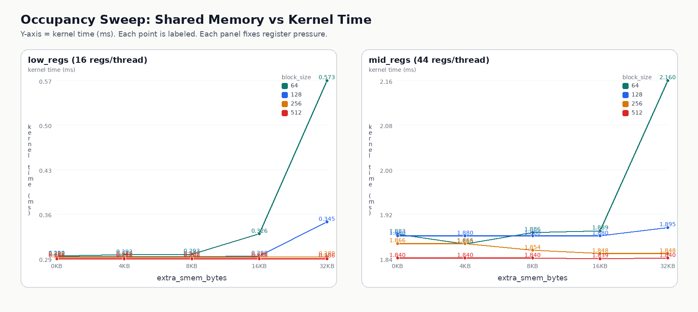

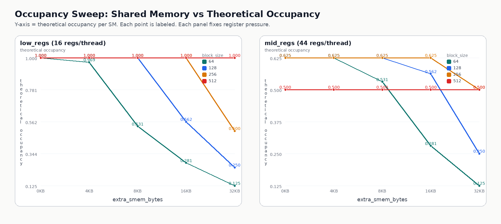

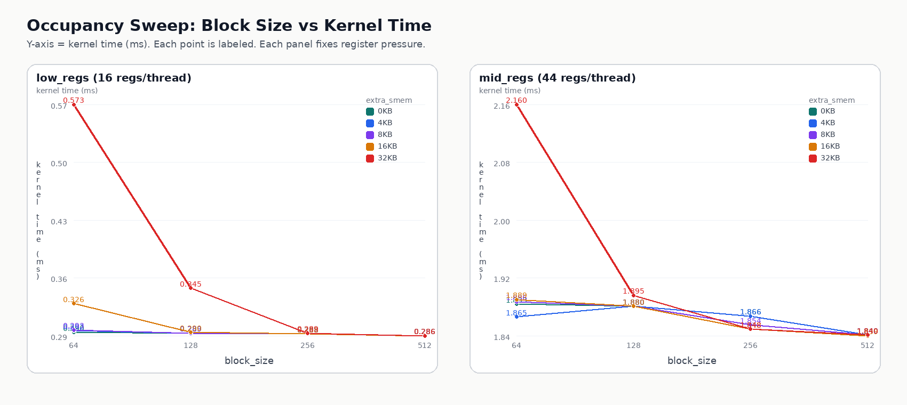

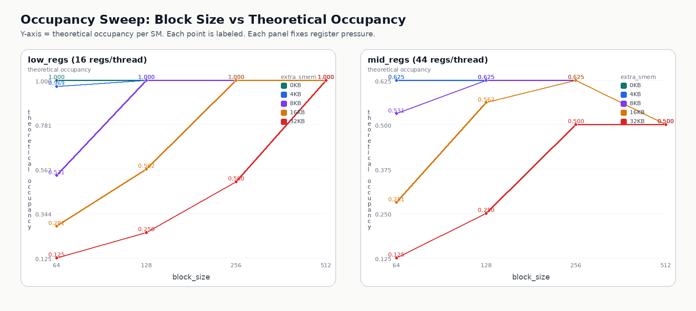

预期：

- `extra_smem_bytes` 增大时，先压低单 SM 理论 occupancy，再拉长 `kernel_ms`；`block_size` 的影响相对次要。

结论：

- `low_regs` 下，`block_size=64/128/256/512` 且 occupancy 接近 `1.0` 时，`kernel_ms` 基本稳定在 `0.286~0.290 ms`，说明单改 `block_size` 几乎没有收益。
- `extra_smem_bytes=32KB` 时，`low_regs, block=64` 从 `0.290 ms / 1.000` 变成 `0.573 ms / 0.125`；`mid_regs, block=64` 从 `1.883 ms / 0.625` 变成 `2.160 ms / 0.125`，说明 shared memory 通过压低 occupancy 明显拉长耗时。
- `mid_regs=44 regs/thread` 已经把这台 A100 上的理论 occupancy 压到 `0.625` 或 `0.500`，同时把 `kernel_ms` 整体抬到 `1.84~2.16 ms`，说明这组 kernel 已经进入明显的 register-limited occupancy 区间。

原始数据：

- [`occupancy-sweep-data.txt`](./assets/occupancy-sweep-data.txt)
- [`render_occupancy_sweep_plots.py`](./render_occupancy_sweep_plots.py)

## Instruction Optimization

当前实验使用 [`instruction_optimization.cu`](./instruction_optimization.cu)。

运行命令：

```bash
nvcc -O3 -std=c++17 instruction_optimization.cu -o instruction_optimization
./instruction_optimization
```

环境记录：

| 项目 | 值 |
| --- | --- |
| GPU | NVIDIA A100 80GB PCIe |
| repeats | 100 |
| half2 elems | 16777216 |
| div/mod elems | 16777216 |
| fdivide elems | 16777216 |
| rsqrt elems | 16777216 |
| normalize3 elems | 16777216 |

### half2_arithmetic

| variant | kernel_ms | speedup_vs_float | max_abs_error | max_rel_error | mean_rel_error |
| --- | --- | --- | --- | --- | --- |
| `float` | 0.405280 | 1.000000 | 0.000000 | 0.000000 | 0.000000 |
| `half` | 0.855424 | 0.473777 | 0.039860 | 0.039860 | 0.012704 |
| `half2` | 0.580608 | 0.698027 | 0.039860 | 0.039860 | 0.012704 |

### divmod_strength_reduction

| variant | kernel_ms | speedup_vs_baseline | check |
| --- | --- | --- | --- |
| `div` | 0.054464 | 1.000000 | PASS |
| `shift` | 0.053376 | 1.020384 | PASS |
| `mod` | 0.054080 | 1.000000 | PASS |
| `mask` | 0.053248 | 1.015625 | PASS |

### fdividef_fast_math

| variant | kernel_ms | speedup_vs_precise | max_abs_error | max_rel_error | mean_rel_error |
| --- | --- | --- | --- | --- | --- |
| `precise` | 2.201568 | 1.000000 | 0.000000 | 0.000000 | 0.000000 |
| `fdividef` | 1.439136 | 1.529784 | 0.000031 | 0.000000 | 0.000000 |
| `frcp_mul` | 1.537728 | 1.431702 | 0.000031 | 0.000000 | 0.000000 |

### rsqrt_fast_math

| variant | kernel_ms | speedup_vs_precise | max_abs_error | max_rel_error | mean_rel_error |
| --- | --- | --- | --- | --- | --- |
| `precise` | 2.475872 | 1.000000 | 0.000000 | 0.000000 | 0.000000 |
| `fast_rsqrt` | 1.395200 | 1.774564 | 0.000244 | 0.000001 | 0.000000 |

### normalize3_rsqrt

| variant | kernel_ms | speedup_vs_precise | max_abs_error | max_rel_error | mean_rel_error |
| --- | --- | --- | --- | --- | --- |
| `precise` | 0.432064 | 1.000000 | 0.000000 | 0.000000 | 0.000000 |
| `rsqrt` | 0.426048 | 1.014120 | 0.000397 | 0.000002 | 0.000000 |

结论：

- `half2` 比标量 `half` 快，但这版 pointwise kernel 里仍然慢于 `float`，说明 `__hadd2/__hmul2` 有收益，但收益还不足以覆盖当前数据类型转换与算子结构成本。
- `i / N -> i >> log2(N)` 和 `i % N -> i & (N - 1)` 在 `N=2^k` 时都有小幅收益，当前分别约 `1.02x` 和 `1.02x`。
- `__fdividef` 和 `rsqrtf` 的收益最明显：`__fdividef` 约 `1.53x`，`rsqrtf` 约 `1.77x`；`normalize3` 这种真实场景里 `rsqrt` 仍有收益，但只有约 `1.01x`。

## Branch / Scheduler

当前实验使用 [`branch_scheduler.cu`](./branch_scheduler.cu)。

运行命令：

```bash
nvcc -O3 -std=c++17 branch_scheduler.cu -o branch_scheduler
./branch_scheduler
python3 render_branch_scheduler_plots.py
```

环境记录：

| 项目 | 值 |
| --- | --- |
| GPU | NVIDIA A100 80GB PCIe |
| block size | 256 |
| divergence ops | 64 |
| branch/compute-both body ops | 1 / 2 / 4 / 8 / 16 / 32 |
| scheduler extra smem | 0 / 8KB / 32KB |
| scheduler kernel shape | `dep_chain`: 4 dependent FMA / iter, `ilp4`: 4 independent FMA / iter |

先看两张直观图，再回头看表格会更容易：

- 第一张图按 CUDA Programming Guide `Figure 7` 的思路画 active mask。重点不是“32 个线程各跑各的”，而是“warp 发射一条指令时，到底有多少 lane 处于 active 状态”。
- 第二张图把 `dep_chain` 和 `ilp4` 画成调度时间线。重点不是总指令数变少，而是同一个 warp 内可立刻发射的 ready 指令更多。

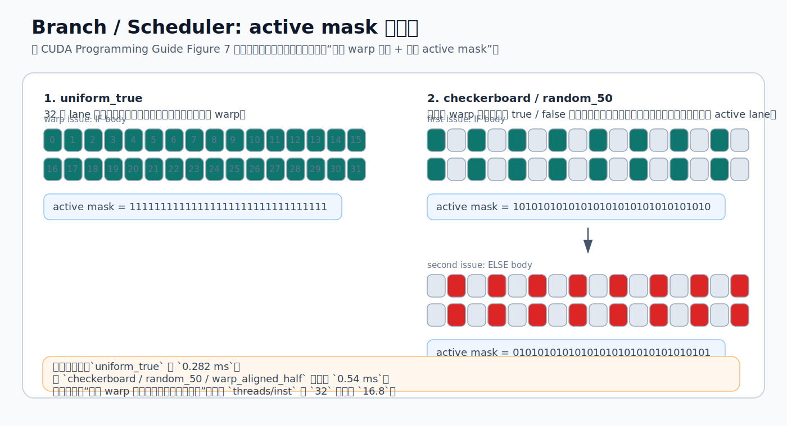

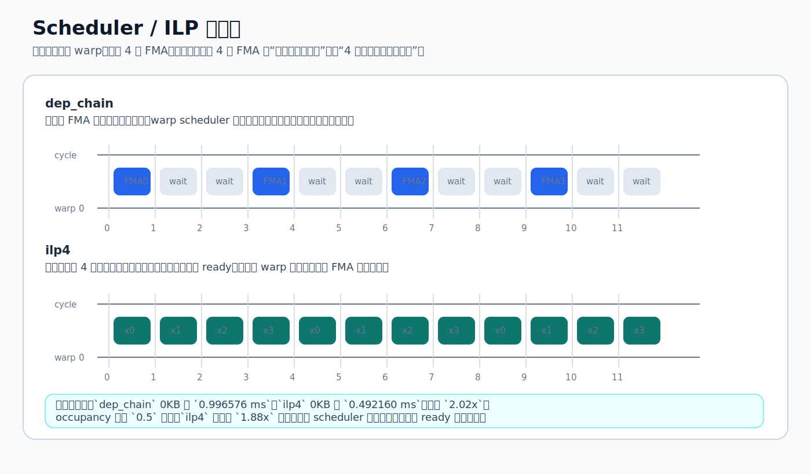

### warp_divergence

| pattern | kernel_ms | speedup_vs_uniform |
| --- | --- | --- |
| `uniform_true` | 0.282176 | 1.000000 |
| `warp_aligned_half` | 0.547104 | 0.515763 |
| `checkerboard` | 0.547136 | 0.515733 |
| `random_50` | 0.541152 | 0.521436 |
| `random_10` | 0.546048 | 0.516760 |

从 `Figure 7` 的角度看，`warp_aligned_half`、`checkerboard`、`random_50` 虽然 lane 排布不一样，但对这个 kernel 来说都把单次发射的有效线程数压到了大约一半，所以时间都接近 `0.54 ms`。

### branch_vs_compute_both

| pattern | body_ops | branch_ms | compute_both_ms | winner |
| --- | --- | --- | --- | --- |
| `uniform` | 1 | 4.621152 | 4.601856 | compute_both |
| `uniform` | 2 | 7.862464 | 7.859360 | compute_both |
| `uniform` | 4 | 14.746464 | 14.771936 | branch |
| `uniform` | 8 | 28.789888 | 28.832064 | branch |
| `uniform` | 16 | 57.150623 | 57.223553 | branch |
| `uniform` | 32 | 113.888641 | 114.028481 | branch |
| `checkerboard` | 1 | 7.079968 | 9.205568 | branch |
| `checkerboard` | 2 | 9.536512 | 15.782144 | branch |
| `checkerboard` | 4 | 15.610944 | 30.043585 | branch |
| `checkerboard` | 8 | 29.252993 | 59.092449 | branch |
| `checkerboard` | 16 | 57.501759 | 117.425377 | branch |
| `checkerboard` | 32 | 114.167969 | 234.219620 | branch |
| `random_50` | 1 | 7.076672 | 8.879040 | branch |
| `random_50` | 2 | 9.283616 | 15.606432 | branch |
| `random_50` | 4 | 15.418112 | 29.904352 | branch |
| `random_50` | 8 | 29.235647 | 58.965633 | branch |
| `random_50` | 16 | 57.389278 | 117.315872 | branch |
| `random_50` | 32 | 113.877663 | 234.116455 | branch |

### scheduler_latency_hiding

| kernel | extra_smem_bytes | theoretical_occupancy | kernel_ms | speedup_vs_dep_0KB |
| --- | --- | --- | --- | --- |
| `dep_chain` | 0 | 1.000000 | 0.996576 | 1.000000 |
| `ilp4` | 0 | 1.000000 | 0.492160 | 2.024903 |
| `dep_chain` | 8192 | 1.000000 | 0.996448 | 1.000129 |
| `ilp4` | 8192 | 1.000000 | 0.492352 | 2.024113 |
| `dep_chain` | 32768 | 0.500000 | 1.129664 | 0.882188 |
| `ilp4` | 32768 | 0.500000 | 0.529792 | 1.881070 |

如果你想把 `scheduler`、`occupancy`、`ILP` 这三个词彻底拆开看，下面这张图更直接：上半部分画“warp 多时可以互相遮延迟”，下半部分画“warp 少时，单个 warp 自己的 ILP 更关键”。

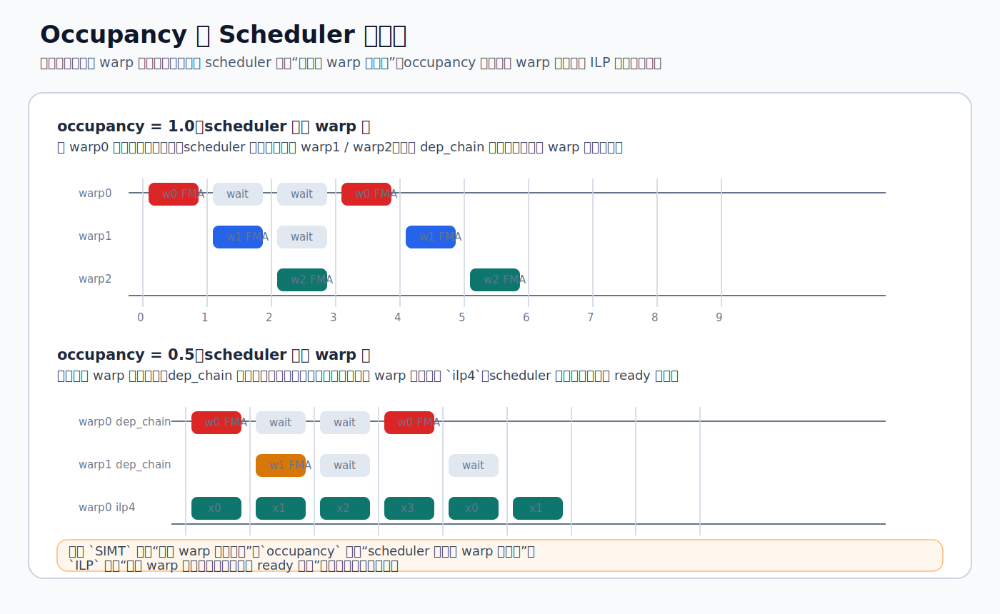

下面这张图把三组关键测量值直接画出来了：左边看 divergence，中间看 `branch` 对 `compute_both`，右边看 occupancy 下降时 `dep_chain` 和 `ilp4` 的相对位置。

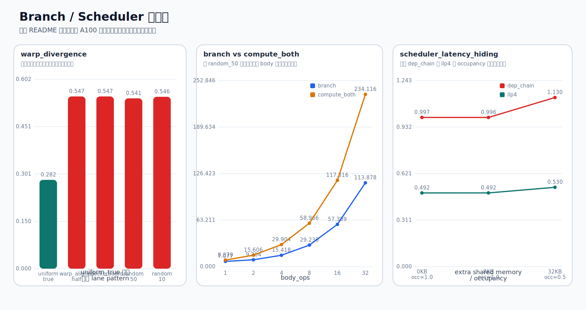

### NCU 摘要

| experiment | variant | key metrics |
| --- | --- | --- |
| `warp_divergence` | `uniform_true` | `threads/inst=32`, `pred_on_threads/inst=31.55`, `branch_uniformity=1.00`, `divergent_branches=0` |
| `warp_divergence` | `checkerboard` | `threads/inst=16.81`, `pred_on_threads/inst=16.55`, `branch_uniformity=0.99`, `divergent_branches=524288` |
| `branch_vs_compute_both` | `branch, random_50, ops=8` | `threads/inst=17.44`, `divergent_branches=268435456`, `inst_executed=1.50e10` |
| `branch_vs_compute_both` | `compute_both, random_50, ops=8` | `threads/inst=32`, `divergent_branches=0`, `inst_executed=2.77e10` |
| `scheduler_latency_hiding` | `dep_chain, 0KB` | `avg_warps_active/issue=20.50`, `warps_eligible.avg=1.63e7`, `inst_issued/issue_active=1.0` |
| `scheduler_latency_hiding` | `dep_chain, 32KB` | `avg_warps_active/issue=10.16`, `warps_eligible.avg=9.16e6`, `inst_issued/issue_active=1.0` |
| `scheduler_latency_hiding` | `ilp4, 32KB` | `avg_warps_active/issue=9.75`, `warps_eligible.avg=8.62e6`, `inst_issued/issue_active=1.0` |

结论：

- warp divergence 会把平均 `threads per inst` 从 `32` 压到约 `16.8`，时间也从 `0.282 ms` 拉高到约 `0.547 ms`，说明这组 kernel 的主要损失就是 warp 内分支分歧。
- `branch_vs_compute_both` 这组里，`compute_both` 虽然完全消掉了 divergent branch，但 `random_50, ops=8` 的动态指令数仍从 `1.50e10` 涨到 `2.77e10`，所以时间从 `29.236 ms` 变到 `58.966 ms`；这说明“把两边都算了再选”并不会因为消掉 divergence 自动变快。
- 当前这组数据的结论很明确：对这种双路径 body，warp divergence 会让 `branch` 变慢，但通常还没有慢到接近“真把 true/false 两边都完整算一遍”；body 越长，`compute_both` 越接近稳定的约 `2x` 额外代价。
- scheduler 这组里，`dep_chain` 和 `ilp4` 的总 FMA 数、循环次数都对齐，唯一差别是前者是 4 个串行依赖 FMA，后者是 4 条独立 FMA 链。
- `ilp4` 在 `0KB` 时比 `dep_chain` 快约 `2.02x`，在 `32KB`、`0.5 occupancy` 时仍快约 `1.88x`；原因不是 `SIMT` 变了，而是同一个 warp 内可发射的 ready 指令更多，scheduler 不必频繁等长依赖链结果返回。
- `SIMT` 解决的是“32 个线程一起执行一条指令”，`ILP` 解决的是“单线程后续指令别全串成一条链”；occupancy 降低后，可切换 warp 变少，所以 `ILP` 的收益更明显。

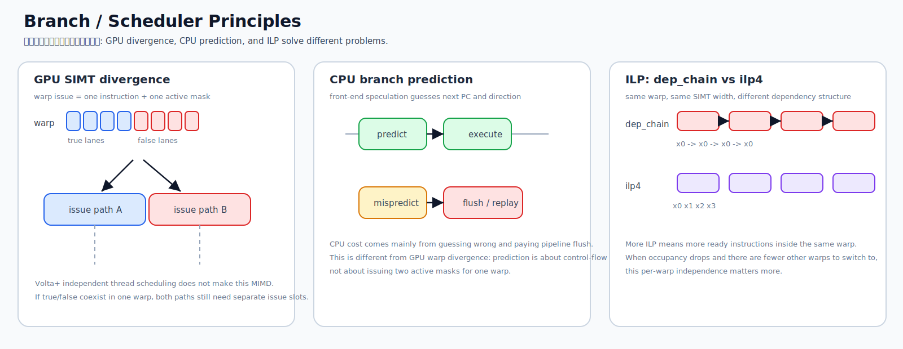

- GPU divergence 的主成本是一个 warp 需要分别发射 true / false 两段 active mask，不是像 CPU 那样先“猜分支”。
- CPU branch prediction 的主成本是猜错后的 pipeline flush；它和 GPU warp divergence 不是同一类机制。
- ILP 不改变 SIMT 宽度，它做的是把单线程里的长依赖链拆开，让同一 warp 内有更多 ready 指令可发。
- occupancy 下降后，可切换的 warp 变少，所以 scheduler 会更依赖单 warp 自己的 ILP 去 hide latency。
